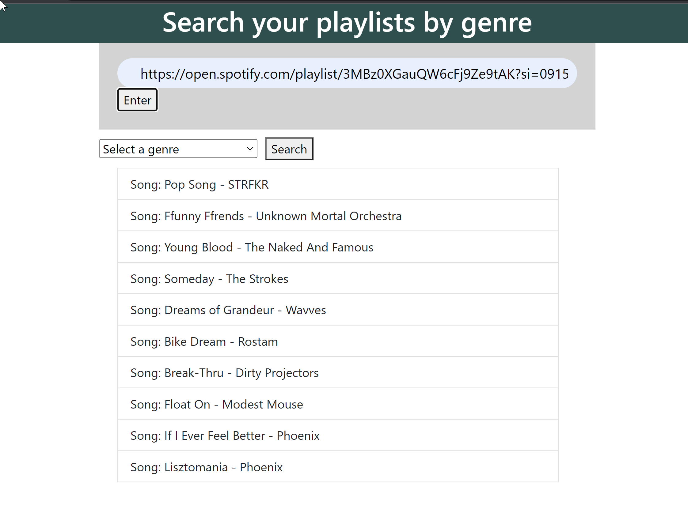
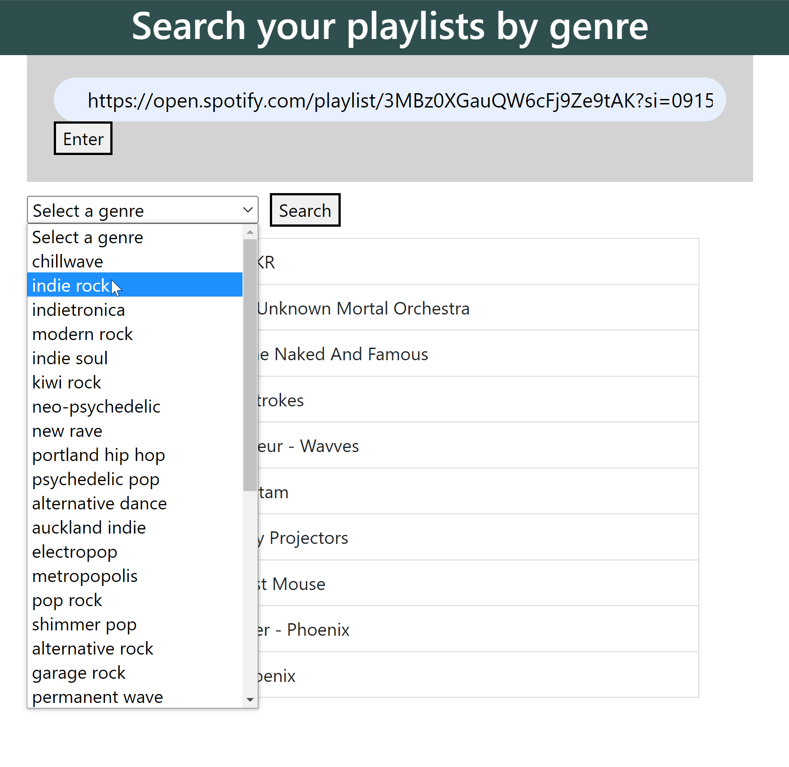
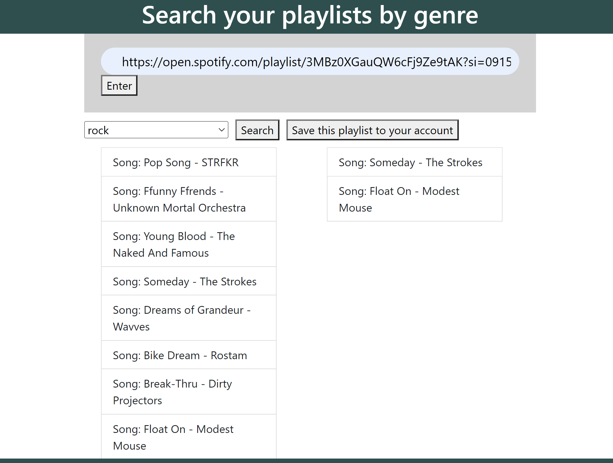

# PlaylistApp
A web app made with Angular and Node that searches the given Spotify playlist by genre.

# Screenshots
<table>
  <tr>
    <td valign="top"></td>
    <td valign="top"></td>
    <td valign="top"></td>

  </tr>
</table>
# Features
* The user can enter the URL for a Spotify playlist, and the app will show a dropdown menu of all genres contained by the given playlist.
* After the user selects a genre, the app shows which songs in the playlist match that genre.
* The user can save a new playlist to their Spotify account, with songs matching their selected genre from the given playlist.
# Limitations
* Only the first 50 songs in a playlist are searched.
* As detailed below, currently the application is not able to get an authentication token from Spotify to access the user's account, so the token must manually be set before running. 

# Installation
Clone the github repository
An OAuth authentication token from Spotify’s API website is necessary before running the project: https://developer.spotify.com/console/post-playlists/
Click “Get Token” and select “playlist-modify-private” and ”playlist-read-private”
After pressing the request token button, copy that token and replace the access token in /backend/app.js
